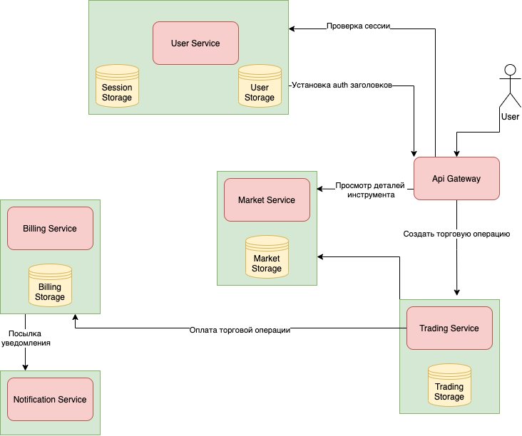

# Биржевая торговля с использованием микросервисной архитектуры

## Пользовательские истории

* Регистрация пользователя

Как **незарегистрированный пользователь** я хочу иметь возможность **зарегистрироваться** в приложении, чтобы иметь возможность пользоваться им.

* Аутентификация

Как **зарегистрированный пользователь** я хочу иметь возможность **войти** в приложение, предоставляя свои **логин и пароль** указанные при регистрации, чтобы начать пользоваться функциональными возможностями приложения.

* Выход из приложения

Как **зарегистрированный пользователь** я хочу иметь возможность выйти из приложения, чтобы воспользоваться другим **аккаунтом**.

* Пополнение брокерского счета

Как **зарегистрированный пользователь**, я хочу иметь возможность пополнить свой **брокерский счет**, чтобы совершать операции на **бирже**

Как **зарегистрированный пользователь**, я хочу иметь возможность узнать количество средств на моем брокерском счету

* Поиск инструмента

Как **незарегистрированный пользователь** я хочу иметь возможность найти интересующии меня **инструменты**, чтобы узнать о **цене**.

Как **зарегистрированный пользователь** я хочу иметь возможность найти интересующии меня **инструменты**, чтобы узнать о **цене** и иметь возможность **совершить покупку или продажу**.

Информация об инструменте включает в себя:
- Тип инструмента
- Название
- Описание
- Тикер
- Доступное количество инструмента
- Стоимость единицы инструмента

* Покупка инструмента

Как **зарегистрированный пользователь** я хочу иметь возможность **купить инструменты**.

* Продажа инструментов

Как **зарегистрированный пользователь** я хочу иметь возможность **продать инструменты**.

* История операций

Как **зарегистрированный пользователь** я хочу иметь возможность **просматривать историю своих операций**.

## Схема взаимодействия сервисов

## Описание сервисов

* User service

Ответственен за регистрацию/аутентификацию и хранение профилей пользователей

* Trading service

Прием торговых заявок. Отвечает за операции над инструментами, такие как покупка/продажа инструментов.

* Market service

Ответственен за хранение данных по инструментам: цена, информация.

* Billing service:

Упраляет данными о балансе пользователя.
Хранит и ведет историю финансовых транзакций (пополнение баланса и оплата).
Отвечает за консистентность финансовый данных.
Слушает события User service. Создает финансовый аккаунт при регистрации пользователя.

* Notification service

Рассылает уведомления.

* API gateway

Ответственен за роутинг запросов
Rate limiting
Кэширование
Canary деплои
